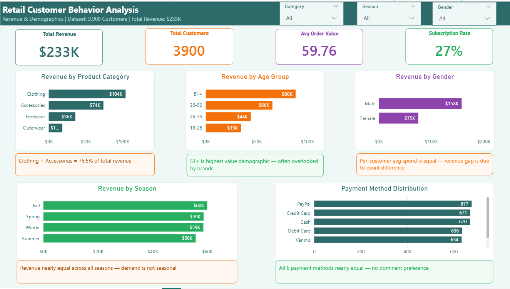
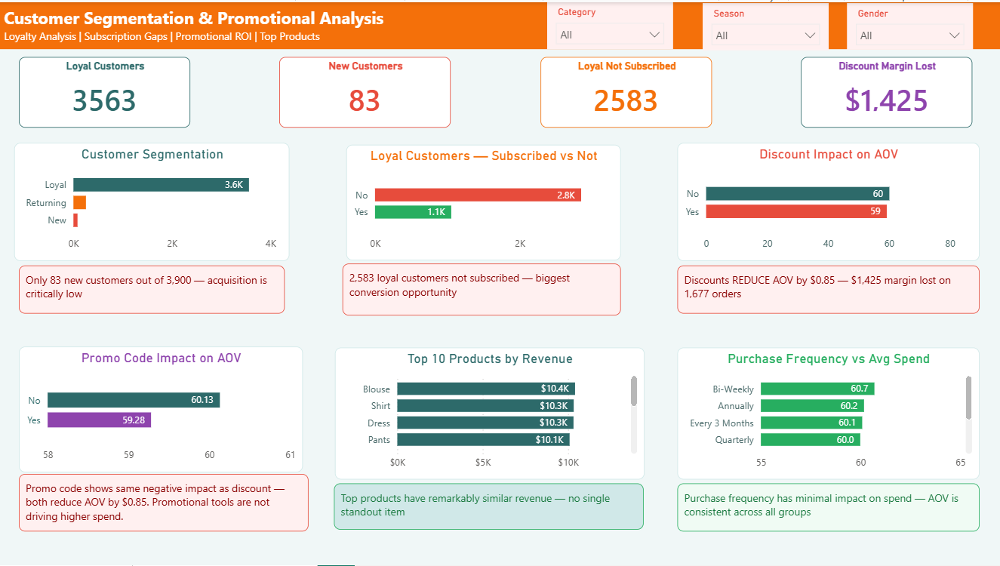
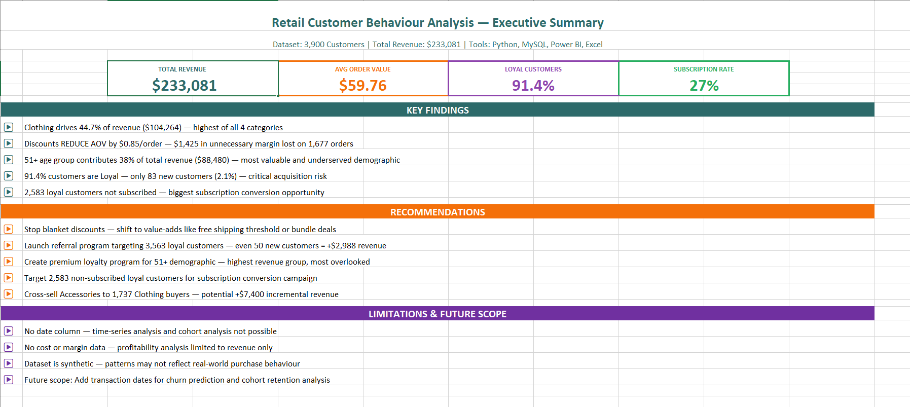

# Retail Customer Behaviour Analysis
### Revenue Optimization & Customer Segmentation using Python, SQL, Power BI & Excel


---

## Business Problem

A retail e-commerce business was running discount campaigns and 
subscription programs without knowing whether they were actually 
working. Management had no clear view of which customer segments 
drove revenue, whether promotions were delivering ROI, or why 
new customer acquisition had stalled.

This project analyzes 3,900 customer transactions across 18 attributes 
to answer these questions — and the findings challenge several common 
business assumptions about discounts, subscriptions, and demographics.

---

## Dataset

| Attribute | Detail |
|-----------|--------|
| Total Rows | 3,900 customers |
| Total Columns | 18 attributes |
| Missing Values | 0 |
| Total Revenue | $233,081 |
| Avg Order Value | $59.76 |
| Age Range | 18 to 70 years |
| Categories | Clothing, Accessories, Footwear, Outerwear |
| Unique Column | Promo Code Used — enables promotional analysis |

---

## 6 Business Questions

| # | Question |
|---|----------|
| BQ1 | What percentage of customers are Loyal vs Returning vs New? |
| BQ2 | Do discounts actually increase average order value? |
| BQ3 | Which product category drives the highest revenue? |
| BQ4 | Do subscribers spend more than non-subscribers? |
| BQ5 | Which age group contributes most to total revenue? |
| BQ6 | Is there a meaningful difference between Promo Code and Discount impact? |

---

## Key Findings

- **Clothing drives 44.7% of revenue** ($104,264) — but creates 
  concentration risk. Clothing + Accessories = 76.5% of total revenue.

- **Discounts REDUCE AOV by $0.85 per order** — 1,677 discounted 
  orders × $0.85 = $1,425 in unnecessary margin erosion. 
  Promotional strategy has negative ROI.

- **51+ age group = 38% of total revenue** ($88,480) — highest of 
  all demographics and most underserved by retail marketing.

- **91.4% of customers are Loyal** — but only 83 customers (2.1%) 
  are new. The business has a critical acquisition gap and a 
  growth ceiling risk.

- **Subscribers do not spend more** ($59.49 vs $59.87) — subscription 
  value is non-monetary. 2,583 loyal customers are not subscribed — 
  the single biggest conversion opportunity in the dataset.
  
---
## Dashboard Preview

### Page 1 — Revenue & Demographics


### Page 2 — Customer Segmentation & Promotions


### Interactive Dashboard File
The full interactive Power BI dashboard with slicers and filters
is available in the dashboard folder.

[Download Power BI Dashboard File](https://github.com/priyanka-insights/retail-customer-behaviour-analysis/raw/main/dashboard/retail_customer_behaviour_analysis.pbix)

> Open the .pbix file in Power BI Desktop to interact with 
> Category, Season, and Gender slicers across both pages.
---

## Excel Executive Report

A manager-ready one-page summary built in Excel — 
printable and shareable without requiring Power BI access.



---


## Tools & Workflow

| Phase | Tool | Deliverable |
|-------|------|-------------|
| Phase 1 | Project Setup | Folder structure, business questions |
| Phase 2 | Python — pandas, numpy, matplotlib, seaborn | EDA notebook — 7 charts |
| Phase 3 | MySQL | 12 business queries with window functions |
| Phase 4 | Power BI | 2-page interactive dashboard |
| Phase 5 | Excel | Executive summary report |
| Phase 6 | Markdown | 5 insights with business recommendations |

---

## Project Structure

```
retail-customer-behaviour-analysis/
│
├── data/
│   ├── shopping_behavior_updated.csv    # Original dataset
│   └── cleaned_shopping_data.csv        # Cleaned for SQL import
│
├── notebooks/
│   └── 01_EDA_analysis.ipynb            # Python EDA — 7 charts
│
├── sql/
│   └── analysis_queries.sql             # 12 MySQL queries
│
├── dashboard/
│   ├── page1_executive.png              # Revenue & Demographics
│   └── page2_segmentation.png           # Segmentation & Promotions
│
├── excel/
│   └── Customer_Behaviour_Analysis.xlsx # Executive summary report
│
├── outputs/
│   └── insights_and_recommendations.md  # 5 structured insights
│
└── README.md
```
---
## How to Run

**Step 1 — Clone the repository**
```bash
git clone https://github.com/priyanka-insights/retail-customer-behaviour-analysis.git
```

**Step 2 — Install Python dependencies**
```bash
pip install pandas numpy matplotlib seaborn
```

**Step 3 — Open the EDA notebook**
```bash
cd notebooks
jupyter notebook 01_EDA_analysis.ipynb
```

**Step 4 — Import data to MySQL**
```bash
# Import cleaned_shopping_data.csv into MySQL
# Then run sql/analysis_queries.sql
```

**Step 5 — Open Power BI Dashboard**

---

## Recommendations Summary

1. **Stop blanket discounts** — shift to free shipping thresholds 
   or bundle deals. Potential margin recovery: $1,425+

2. **Launch referral program** targeting 3,563 loyal customers 
   as brand ambassadors. Even 50 new customers = +$2,988 revenue.

3. **Create 51+ premium loyalty program** — highest revenue group, 
   most underserved. Conversion target: 107 new subscribers.

4. **Target 2,583 non-subscribed loyal customers** with corrected 
   subscription messaging focused on convenience, not savings.

5. **Cross-sell Accessories to Clothing buyers** — 1,737 Clothing 
   customers targeted = potential +$10,380 incremental revenue.

---

## Limitations

- No date column — time-series and cohort analysis not possible
- No cost data — profitability analysis limited to revenue only  
- Dataset is synthetic — patterns may not reflect real-world behaviour

---


*Dataset: E-commerce Shopping Behaviour | 3,900 rows | 18 columns*
